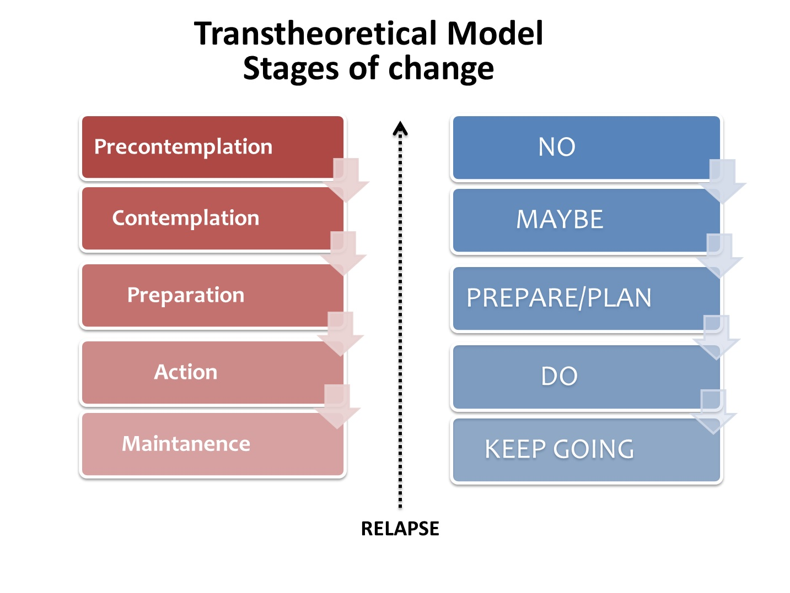
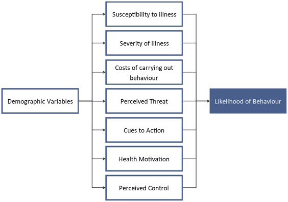
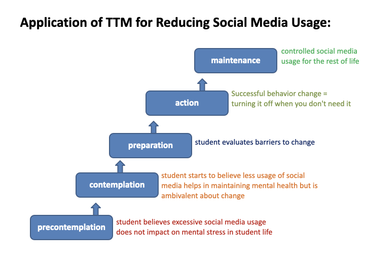
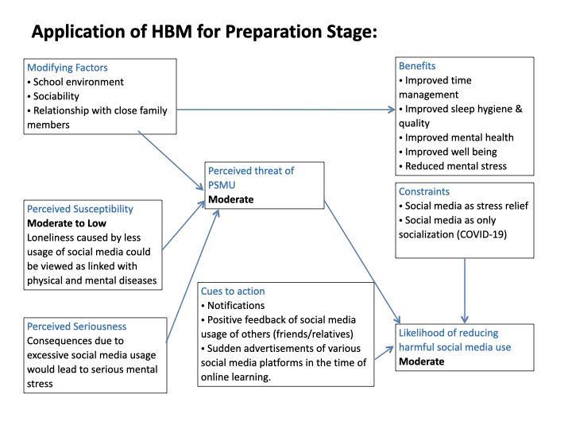
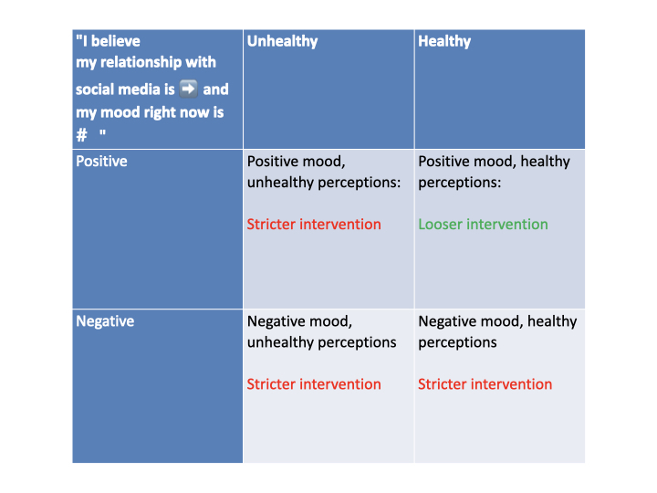

```{r setup, include = FALSE}
library("papaja")
r_refs("HINF5200.bib")
```

```{r analysis-preferences}
# Seed for random number generation
set.seed(42)
knitr::opts_chunk$set(cache.extra = knitr::rand_seed)
```

# Introduction

Young adults account for the majority of social media users. Recent data shows
that 84% of U.S. adults aged 18 to 29 report frequently using any kind of 
social media, and the COVID-19 pandemic has made social media use ubiquitous 
for many [@auxierSocialMediaUse2021]. This is particularly important for college
students who have had to adjust to remote or hybrid learning, and are required
to engage with instructors and peers on social media. Unfortunately, the rise
of social media has brought with it a prevalence of _problematic social media use_
(PSMU). Problematic social media use can be defined in multiple ways, such as
addiction (the inability to cease the behavior regardless of known negative
impacts), dependency (an inability to achieve goals without the behavior),
compulsive use, excessive use, and disordered
use [@huangMetaanalysisProblematicSocial2022]. A recent meta-analytic study confirms that
problematic social media use can have negative effects on both 
physical and mental health[@huangMetaanalysisProblematicSocial2022]. 
The study found that problematic social media use was negatively correlated
with indicators of well-being, while being positively correlated with anxiety,
depression, and distress. Importantly, findings were robust across multiple countries.

In considering these challenges, it is important to also acknowledge the
technology-based environment that students now find themselves in due to the
pandemic. Zhao and Zhuo [-@zhaoCOVID19StressAddictive2021] raised worrying
evidence of the link between the COVID-19 pandemic and addictive social media
use, while @barbosa-camachoDepressionAnxietyAcademic2022 showed that COVID-19
had a significant negative influence on students’ mental well-being as it 
pertains to the classroom, in the domains of anxiety, depression, and
self-perception. An international report by UNESCO reports that over 50% of
students felt overwhelmed by the pandemic and how it would affect their
schoolwork, and the data suggests that vulnerable students (such as those in
low or underserved SES categories) are statistically more likely to fall behind
in class as the pandemic continues [@meinckImpactCOVID19Pandemic2022].
Likewise, Jiang [-@ngienEffectSocialMedia2022] found that  students who
endorsed being concerned that their academic performance had been affected
by the pandemic, tended to have higher levels of base anxiety, and these
same students tended to report higher levels of PSMU.

Further findings from Jiang [-@jiangProblematicSocialMedia2021], however,
also provide evidence that the link between mental well-being, the pandemic, and social media,
is multifaceted. This particular study found that while the relationship
between student anxiety and their social media use was not significant in
their sample, the moderating effect of students’ perceived fatalism — the
belief that one’s health is not self-determined — was significant, suggesting
that the outcome of decreased mental well-being was strongly tied to students’
perceptions about their sense of autonomy and control over their own health.
This is supported by a reviews by @haddadImpactSocialMedia2021 and
@alshareDoubleedgedSwordSocial2022 who concluded that
COVID-19 acts as a moderator between social media use (problematic or not) and
mental health.

Given the prevalence of social media, the increased stress of the ongoing
pandemic, and the deleterious effects of problematic
social media use, our group aims to use behavior change theories to inform the
implementation of a fictional technological intervention for college students
exhibiting problematic social media use. We aim to implement a novel mobile
application to help users  mindfully budget their time on social media. 
Significantly for this paper, we leverage behavior change theories
relevant to health _beliefs at the intrapersonal level_ to inform the design
and implementation of our proposed intervention.

## Relevant Behavior Change Theories

At the intrapersonal or individual level, health behavior change theories primarily address
constructs within the individual that influence behavior, such as beliefs about self and the world around them,
intrinsic and extrinsic motivations, perceived skills, previous experiences, and acquired knowledge [@glanzHealthBehaviorTheory2015].
There are a handful of currently prevalent individual-level theories, but for
this paper we've elected to narrow our focus to the Transtheoretical Model for
Stages of Change (TTM), and the Health Belief Model (HBM). TTM 
conceptualizes behavior change as a sequence of stages that 
unfolds over time as individuals progress through different beliefs about their
health [@prochaskaTranstheoreticalApproach2005]. There are five discrete stages of change in this model – 
precontemplation, contemplation, preparation, action, and maintenance (see Figure\ \@ref(fig:ttm)).
TTM has seen widespread adoption and success in a variety of different fields
and scenarios, and is highly adaptable.

Relatedly, the Health Belief Model (HBM) suggests that an individual’s
perceptions most strongly predict their health-related actions or behaviors [@rosenstockHealthBeliefModel1974]. 
The model is based on six interrelated constructs: perceived susceptibility,
perceived severity, perceived benefits, perceived barriers to action, 
self-efficacy, and cues to action (see Figure\ \@ref(fig:hbm)). HBM is one of
the oldest models of behavior change that is still used widely to this day.

(ref:ttm-caption) Visual Schematic of the Transtheoretical Model for Stages of Change. Source: [Wikipedia](https://en.wikipedia.org/wiki/Transtheoretical_model)

```{r ttm, fig.cap = "(ref:ttm-caption)"}

```


(ref:hbm-caption) Visual Schematic of the Health Belief Model. Source: [ScienceDirect](https://www.sciencedirect.com/topics/medicine-and-dentistry/health-belief-model)

```{r hbm, fig.cap = "(ref:hbm-caption)"}

```

While both TTM and HBM have had notable popularity in health interventions in 
various scenarios that may include social media as an environment or 
intervention delivery medium [@al-sabbaghPredictorsAdherenceHome2022; @al-tahitahHowCOVID19Pandemic2021; @frithCanFacebookReduce2017; @JMIRPublicHealth; @sardiBlood4LifeMobileSolution2019; @zarebanEffectEducationBased2022], there are
no published studies demonstrating the use of either TTM or HBM in a
problematic social media use _intervention_. That being said, there is existing literature
to support the potential for success of a well-planned intervention for problematic social
media use. One study implemented cognitive reconstruction, a primary goal of
cognitive behavioral therapy, to significantly reduce social media addiction
amongst an experimental cohort of 21 students, compared to the control group [@houSocialMediaAddiction2019]. On the other hand, a separate study found that
simply instructing participants with social media addiction to abstain from
social media for 7 days resulted in 59% of participants relapsing, and most
experiencing severe withdrawal symptoms [@stiegerWeekUsingSocial2018].

## Applied Behavior Change Mechanisms

To develop the intervention, we apply the selected models to the individual
with PSMU as summarized in Figure\ \@ref(fig:ttmapp) and 
Figure\ \@ref(fig:hbmapp).
As Figure\ \@ref(fig:ttmapp) illustrates, the aim of TTM is to categorize
an individual along the axes of stages based on their attitudes and beliefs
about a behavior change, and use our understanding of that stage to inform how
to encourage a shift in perception towards the next stage.
As a thought experiment, consider a student exhibiting PSMU in need of a
behavior change, but does not intend to take any action in the near future — the
individual is not aware that excessive social media use may yield the negative effects
described in the introduction. This student would be classified into the
precontemplation stage. In the contemplation stage, the student may recognize their
behavior as problematic, but may still feel ambivalent toward a change in 
behavior. In the preparation stage, the student may be ready to confront
barriers to taking necessary action. In the action stage, the student is actively
modifying their behavior, for example by consuming less social media. Lastly,
in the maintenance phase, the student's social media habits no longer constitute PSMU and
this behavior is maintained in the long term.

(ref:ttmapp-caption) Application of the TransTheoretical Model for Stages of Change to students with problematic social media use.


```{r ttmapp, fig.cap = "(ref:ttmapp-caption)"}

```

We believe that an appropriate technological intervention may best be implemented
for students in the preparation stage, so we employ HBM to carefully examine
health belief factors that an intervention at this stage must address. As
Figure\ \@ref(fig:hbmapp) illustrates, perceptions about susceptibility and
seriousness contribute to a student's perceived threat of PSMU, which we
estimate is _moderate_. A number of benefits of managing PSMU (culminating in
improved well-being) conflict with various perceived constraints (such as the
temptation of habit and ubiquity of social media), while modifying external
factors also influence an individual's beliefs. This, taken into account with
various environmental cues (such as mobile notifications) all constitute our
hypothetical student's beliefs about their PSMU at the preparation stage of
change. We believe the average student in this scenario has a moderate likelihood
of taking action on their behavior.

(ref:hbmapp-caption) Application of the Health Belief Model to the Preparation stage of TTM in students ready to confront their problematic social media use.

```{r hbmapp, fig.cap = "(ref:hbmapp-caption)"}

```


# Methods

## Population

We propose our intervention for undergraduate college students who exhibit
problematic social media use. Ideally, a cohort of participants would be of
legal adult age and racially-,
ethnically-, and gender-diverse, as systematic reviews and meta-analyses have
established such universality of PSMU. Participants would be required to have
a smartphone (OS agnostic) that they use comfortably and regularly for interacting with the
social media apps of their choice. Social media apps may include, but are not
limited to, Facebook, Instagram, Snapchat, TikTok, Reddit, Whatsapp, Telegram,
and many others.

We don't foresee any exclusion criteria; participants
would initially attend a consent and intake session where they would complete
the Bergen Social Media Addiction Scale [@duradoniWellBeingSocialMedia2020] 
and the Social Media Disorder Scale [@vandeneijndenSocialMediaDisorder2016] to
collect baseline data on participants' relationships with their social media.
Further, participants would also be asked to complete the Beck Depression Inventory, the Patient Health Questionnaire, and Generalized Anxiety Disorder
scale, to gather data on participants' baseline mood and anxiety scores [@shevlinMeasurementInvariancePatient2022]. Participants will participate in the
intervention for at least 1 month, after which they will return to the lab to
retake the above battery of surveys.

## Technological Intervention

Our group proposes to implement a mobile application that will allow participants
to budget the amount of time they spend on social media per week, and reflect on
their experience after each significant interaction on social media. Our hypothesis is
that PSMU can be minimized by changing the individual's perceptions about their
use of social media. The app's goals, therefore, are to empower the user to:

1. **Be in control of their own limitations.** We hypothesize from our HBM model
that the strongest components affecting the likelihood of change are
constraints from the _need_ for a social media presence 
(Figure\ \@ref(fig:hbmapp)). This autonomy addresses these constraints directly
by enabling the user to be mindful of the value of their own time.

2. **Be mindful about their mood.** We also hypothesize from the HBM model
that the benefits to mental health are not salient enough for students exhibiting
PSMU (Figure\ \@ref(fig:hbmapp)). By providing reflections on their mood, we 
expect that users will develop greater mindfulness about their relationship with
social media, and how that relationship affects their mood.

To address goal 1, the app can set varying levels of "strictness" for encouraging
users _not_ to open the app. In order of strictness:

- Displaying a count-up timer of how much time has been spent on social media that week;

- Displaying a count-down timer of how much time is left;

- Banner notifications while using social media when a large amount of their
budget has been used ("you have used half your budget for the week"; "you have 1 hour remaining in your budget");

- Adding an interruption screen upon opening the social media app, to give users
a salient decision point ("Are you sure you want to open Facebook?");

- Hiding the app from the homescreen (ensuring the app is not easily accessible);

To address goal 2, the app will implement short Ecological Momentary Assessments (EMA)
at the end of each significant social media session (app is running and open
in the foreground for longer than 2 minutes). The EMAs will be used both to allow the user to briefly
reflect on their mood and relationship with social media, and to provide the
app with data that will inform where to set the strictness of the intervention
going forward. EMA questions could include (with addressed goals in parentheses),
"How much time do you believe you spent on social media today?" (goal 1); "Do you feel your time was well spent?" (goal 1); "Is there anything you would have preferred to do with your time today?" (goal 1); "Rate your mood right now" (goal 2).

With the responses to these questions, the app can use this data to aid the user in maintaining their
desired budget by adjusting the strictness of intervention, if necessary.

### User Story

0. User joins the study, completes intake materials, and installs the intervention 
app on their phone.

1. User sets a budget for social media use, in hours.

2. User opens a social media app.

3. In the background, the intervention app tracks use of social media against the
budgeted time.

4. User closes the social media app.

5. The intervention app prompts the user to fill out a short EMA survey.

6. The app evaluates EMA responses and, if necessary, changes the strictness
of the intervention.

## Assessment of Results

The app will evaluate EMA responses continuously, and adjust strictness of
the intervention according by considering changes in both mood and perceptions
since the last complete survey. See Figure\ \@ref(fig:conf) for an illustration.
When participant mood has decreased since their last survey, or their perception
about how much time they have spent on social media has decreased, the app will
implement a stricter intervention. Exact decision points for how much mood has
to decrease, or how much their positive self-perception has to decrease, in
order for an intervention change to take effect should
be determined by psychometric internal validity, which is outside the scope of
this proposal.

(ref:conf-caption) Confusion Matrix of participant mood and participant perception
of relationship with social media.

```{r conf, fig.cap = "(ref:conf-caption)"}

```

After the course of the intervention, participants will have ideally
completed both a pre- and post-intervention battery of psychometric measures of
mood, anxiety, depression, and social media addiction questionnaires. Appropriate
statistical testing (such as ANOVA) can be used to assess the effectiveness of
this intervention.

# Conclusion

Problematic social media use is a rising and prevalent problem affecting people
now more than ever due to our increased engagement in online spaces as we grapple
with the ongoing pandemic. This problem is affecting students especially,
and it is estimated to get worse. This paper outlined a proposed technological
intervention, backed by two sound health behavior change theories. The
Transtheoretical Model categorizes students along a sequence of stages towards
behavior change, and the Health Belief Model is used to further analyze student
attitudes about PSMU at the "preparation to change" stage. In this paper,
we developed a proposal for a mobile application aimed at minimizing PSMU in
students by 1) helping them budget their time spent on social media, and 2)
providing them with EMAs that allow them to reflect on their perceptions about
social media use and how it affects their health. These two features work together
to specifically address tangible constructs identified in our HBM analysis.

\newpage

# References

::: {#refs custom-style="Bibliography"}
:::
